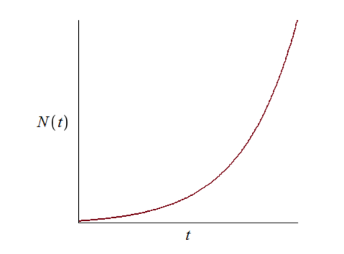

# Advertising effectiveness. Step 1
 

---

## Formulation of the problem

How to sell goods on the market?

1. Organize an advertising campaign for a new product  

2. Ensure that profits excessively cover advertising costs  

---

## The main problem

Необходима эффективная рекламная кампания!

---

### **The main proiect purpose:**

finding the dependence of sales on the effectiveness of an advertising campaign.

--- 

### **Project objectives:**

- project model  

- project algorithmization 

- translation of algorithms into code  

---

## What is advertising?

**Advertising** is a direction in marketing communications, within the framework of which information is disseminated to draw attention to the object of advertising with the goal of forming or maintaining interest in it.

---

## Campaign Model

### **Factors**

The main factors influencing sales are:

1. $N$ - the number of potential buyers
2. $t$ - elapsed time from the start of the campaign
3. $n (t)$ - the number of already informed buyers
4. $a (t)$ - the intensity of the advertising campaign

---
## Campaign Model

$$\frac{\mathrm{d}n}{\mathrm{d}t} = (a_1(t) + a_2(t)n(t))(N - n(t))$$

$ \frac {\mathrm{d} n}{\mathrm{d} t} $ - the rate of change in the number of consumers who find out about the product and are ready to buy  
$ a_1 (t) (N - n (t)) $ -number of already informed buyers in proportion to the number of not yet informed buyers - Malthus model 

---

$ a_2 (t) n (t) (N - n (t)) $ - information dissemination by customers who already know about the product - logistic curve  
$ N - n (t) $ - the number of potential buyers who do not know about the product  

---

## Campaign Model

$$\frac{\mathrm{d}n}{\mathrm{d}t} = (a_1(t) + a_2(t)n(t))(N - n(t))$$

For $a_1(t)\gga_2(t)n(t)$ we get a model of the Maltus type:

---

## Campaign Model

$$\frac{\mathrm{d}n}{\mathrm{d}t} = (a_1(t) + a_2(t)n(t))(N - n(t))$$

For $a_1(t)\lla_2(t)n(t)$ we get the equation of the logistic curve::

