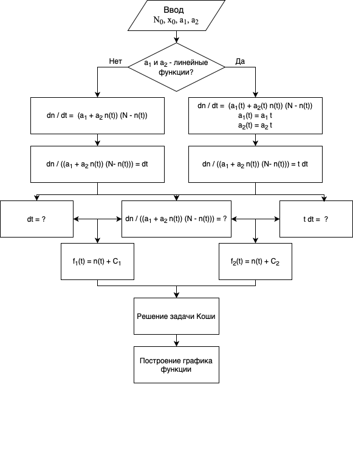

# Advertising effectiveness
# Step 2

---

## Campaign Model

The main factors influencing sales are:

1. $N$ - the number of potential buyers
2. $t$ - elapsed time from the start of the campaign
3. $n (t)$ - the number of already informed buyers
4. $a (t)$ - the intensity of the advertising campaign

---
## Campaign Model

$$\frac{\mathrm{d}n}{\mathrm{d}t} = (a_1(t) + a_2(t)n(t))(N - n(t))$$

$ \frac {\mathrm{d} n}{\mathrm{d} t} $ - the rate of change in the number of consumers who find out about the product and are ready to buy
$ a_1 (t) (N - n (t)) $ -number of already informed buyers in proportion to the number of not yet informed buyers - Malthus model

---

$ a_2 (t) n (t) (N - n (t)) $ - information dissemination by customers who already know about the product - logistic curve
$ N - n (t) $ - the number of potential buyers who do not know about the product

---

## Campaign Model

$$\frac{\mathrm{d}n}{\mathrm{d}t} = (a_1(t) + a_2(t)n(t))(N - n(t))$$

For $a_1(t) >> a_2(t)n(t)$ we get a model of the Maltus type:

---

## Campaign Model

$$\frac{\mathrm{d}n}{\mathrm{d}t} = (a_1(t) + a_2(t)n(t))(N - n(t))$$

For $a_1(t) << a_2(t)n(t)$ we get the equation of the logistic curve::

---

---

## Differential equation solution

$$ 1. \frac{dn}{dt} =(a_1 + a_2n)(N - n) $$

$$ 2.  \frac{dn}{dt} =(a_1 + a_2(t)n)(N - n) $$ 

Wherein

$$ a_1(t) = a_1t $$

$$ a_2(t) = a_2t $$

---

## Differential equation solution

$$ 1.\frac{dn}{(a_1 + a_2n)(N - n)} = dt $$ 

$$ 2.\frac{dn}{(a_1 + a_2n)(N - n)} = tdt $$

---

## Differential equation solution

$$ \int\, \mathrm{d}t = t + C $$
$$ \int t\, \mathrm{d}t = \frac{t^2}{2} + C $$
$$ \int \frac{dn}{(a_1 + a_2n)(N - n)}\, \mathrm{d}t = ??? $$

---

$$ -\int \frac{dn}{(a_1 + a_2n)(-N + n)}\, \mathrm{d}t =  $$

$$ = \frac{1}{a_2n+a_1}\int\frac{1}{n-N}\, \mathrm{d}n - $$

$$ - \frac{a_2}{a_2N + a_1} \int \frac{1}{a_2n + a_1} \mathrm{d}n  $$

---

$$ \int \frac{dn}{n-N} = \int \frac{d(n-N)}{n-N} $$
$$ \int \frac{d(n-N)}{n-N} = ln(n-N) $$
$$ \int \frac{dn}{a_1y+a_2} = \frac{ln(a_2n+a_1)}{a_2} $$

---

$$ \frac{1}{a_2N} (\int (\frac{1}{n-N} - \frac{a~2}{a_2n+a_2})dn = $$

$$ \frac{1}{a_2N} (ln(n-N) - ln(a_2n+a_1)) $$

---

$$ n(t) = \frac{a_1 + Ne^{(a_1+a_2N)(T+C)}}{-a_2 + e^{(a_1+a_2N)(T+C)}} $$
 
$$ C = \frac {ln\frac{N_0a_2+a_1}{N_0-N}}{a_1+a_2N} - X_0 $$

---
If a_1 and a_2 are linear functions:

$$ X = x $$

If a_1 and a_2 are constants:

$$ X = \frac {x^2}{2} $$

