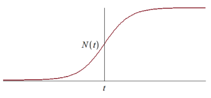

# Advertising effectiveness

by:
- Rodina Darya  
- Kartashova Alice  
- Sasin Yaroslav  
- Vasilieva Julia  

---

## Campaign Model

### **Factors**

The main factors influencing sales are:

1. $N$ - the number of potential buyers
2. $t$ - elapsed time from the start of the campaign
3. $n (t)$ - the number of already informed buyers
4. $a (t)$ - the intensity of the advertising campaign

---
## Campaign Model

### Model

$$\frac{\mathrm{d}n}{\mathrm{d}t} = (a_1(t) + a_2(t)n(t))(N - n(t))$$

$\frac{\mathrm{d}n}{\mathrm{d}t}$ - скорость изменения числа потребителей, узнавших о товаре и готовых купить  
$a_1(t)(N – n(t))$ -число уже информированных покупателей пропорционально числу еще не информированных покупателей - модель Мальтуса  
$a_2(t)n(t)(N – n(t))$ - распрастранение информации покупателями, которые уже знают о товаре - логистичесая кривая  
$N - n(t)$ - количество потенциальных покупателей, не знающих о товаре

---

## Campaign Model

### Model

$$\frac{\mathrm{d}n}{\mathrm{d}t} = (a_1(t) + a_2(t)n(t))(N - n(t))$$

For $a_1(t)\gga_2(t)n(t)$ we get a model of the Maltus type:

---

## Campaign Model

### Model

$$\frac{\mathrm{d}n}{\mathrm{d}t} = (a_1(t) + a_2(t)n(t))(N - n(t))$$

For $a_1(t)\lla_2(t)n(t)$ we get the equation of the logistic curve::

---

