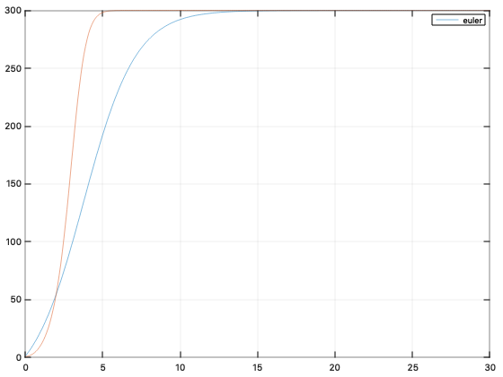
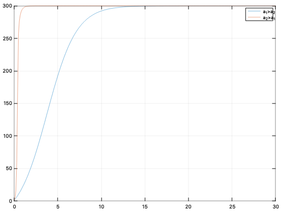
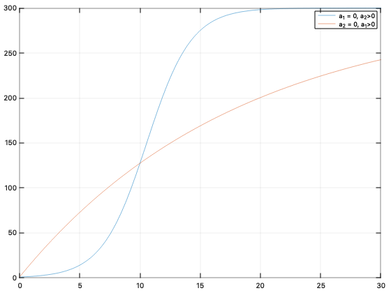

## Эффективность рекламы

---

## Цель проекта: 

Изучение зависимости эффективности рекламы от разных способа предоставления информации.

---

## Задачи проекта: 
- описать модель скорости распространения рекламной кампании;
- разработать алгоритм для нахождения графика, описывающего модель; 
- создать программую реализацию алгоритма;
- проверить реализацию на представленных примерах;
- проанализировать зависимость эффективность рекламы.

--- 

#### Математическая модель рекламной кампании

$$
\frac{\mathrm{d}n}{\mathrm{d}t} = (a_1(t) + a_2(t)n(t))(N - n(t))
  $$

1.  $t$ – время, прошедшее от начала рекламной кампании   
2.  $n(t)$ – число уже проинформированных покупателей  
3.  $N$ – общее число потенциальных покупателей 

---

4.  $a_1(t)$ – коэффициент, показывающий зависимость эффективности рекламы от затрат на рекламу в данный момент времени  
5.  $a_2(t)$ – коэффициент, показывающий зависимость эффективности рекламы от сарафанного радио

---


### Основные факторы влияния

При $a_1(t) >> a_2(t)n(t)$ получаем модель типа Мальтуса:


---

### Основные факторы влияния

При $a_1(t) << a_2(t)n(t)$ получаем уравнение логистической кривой:


---

#### Алгоритм Эйлера для решения дифференциальных уравнений

$$
h = \frac{t_n-t_0}{n}, t_i=t_0+ih, i=1,n
$$

$$
t_p = t_i + \frac{h}{2}, x_p=x_i + \frac{h}{2}f(x_i,t_i)
$$

$$
x_{i+1}=xi+hf(x_p,t_p), i=1,n
$$

---

## Оболочка для решения задач
						
GNU Octave — свободная система для математических вычислений, использующая совместимый с MATLAB язык высокого уровня. Octave представляет интерактивный командный интерфейс для решения линейных и нелинейных математических задач, а также проведения других численных экспериментов.

---

# Программная реализация

---

###  Присвоение значений

```python 
	N0 = 3;
	N = 300;
	a1 = 0.055;
	a2 = 0.0018;
	t0 = 0;
	tk = 30;
```

---

### Оперделение модели

```python
	function l = m(t)
		l = a1*t;
	end
						 
	function n = k(t)
		n = a2*t;
	end
						 
	function y = g(t,x)
		y = (m(t) + k(t)*x)*(N - x);
	end
```

---

### Реализация алгоритма

```python						 
	n = (tk - t0)*10;
						 
	function [x,t]=eiler_m(a,b,n,x0)  
		h=(b-a)/n;
		x(1)=x0;
		for i=1:n+1
			t(i)=a+(i-1)*h;
		end
		for i=2:n+1
			tp=t(i-1)+h/2;
			xp=x(i-1)+h/2*g(t(i-1),x(i-1));
			x(i)=x(i-1)+h*g(tp,xp);
			end
	end
```

---

### Вызов функции и построение графика 

```python
	[x,t] = eiler_m(t0,tk,n,N0);
						 
	plot(t, x, 'x');
	grid on;
	legend ('euler');
```

---

## Точность


---

## Скорость

```python
	» adams
	established_time = 0.47159
	» euler
	established_time = 0.13775
	» r_k
	established_time = 0.27455
	» ode_mf
	time = 0.93001
```

---

## Исследование зависимости

- Учитывается только показатель сарафанного радио
- Учитывается только показатель рекламной кампании

---

- Сарафанное радио эффективнее рекламаной кампании, но присутствует оба показателя
- Рекламная кампания эффективнее сарафанного радио, но присутствует оба показателя

---

Синий график: $a_1 = 0.055$ ,  $a_2 = 0.0018$

Красный график: $a_1(t) = 0.055t$ , $a_2(t) = 0.0018t$



---
				
Синий график: $a_1 = 0.055$ ,  $a_2 = 0.0018$
				
Красный график: $a_1 = 0.0018$ , $a_2 = 0.055$
					


---

Синий график: $a_1 = 0$ ,  $a_2 = 0.0018$

Красный график: $a_1 = 0.0018$ , $a_2 = 0$



---

## Общие выводы по проекту:

- описали модель зависимости скорости распространения рекламы;
- написали и выявили наиболее оптимальный алгоритм;
- исследовали зависимость поведения кривой от коэффициентов.