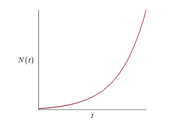
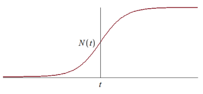

## Эффективность рекламы

# 2 этап

---

## Постановка проблемы

Как реализовать товар на рынке сбыта?

1. Организовать рекламную кампанию нового товара

2. Добиться, чтобы прибыль с избытком покрывала издержки на рекламу 

---

## Проблема

Необходима эффективная рекламная кампания!

---

### **Цель проекта:**

нахождение зависимости продаж от эффективности рекламной кампании 

--- 

### **Задачи проекта:** 

 - модель проекта
 - алгоритмизация проекта 
 - перевод алгоритмов в код  

---

## Что такое реклама?

**Реклама** – направление в маркетинговых коммуникациях, в рамках которого производится распространение информации для привлечения внимания к объекту рекламирования с цель формирования или поддержания интереса к нему.

---

## Модель рекламной кампании

### **Факторы**

Основными факторами влияния на продажи являютя:

1. $N$ - число потенциальных покупателей
2. $t$ - прошедшее время от начала кампании
3. $n (t)$ - число уже информированных покупателей
4. $a (t)$ - интенсивность рекламной кампании

---
## Модель рекламной кампании

$$\frac{\mathrm{d}n}{\mathrm{d}t} = (a_1(t) + a_2(t)n(t))(N - n(t))$$

$ \frac {\mathrm{d} n}{\mathrm{d} t} $ - скорость изменения числа потребителей, узнавших о товаре и готовых купить  
$ a_1 (t) (N - n (t)) $ - число уже информированных покупателей пропорционально числу еще не информированных покупателей - модель Мальтуса 

---

$ a_2 (t) n (t) (N - n (t)) $ - распрастранение информации покупателями, которые уже знают о товаре - логистичесая кривая   
$ N - n (t) $ - количество потенциальных покупателей, не знающих о товаре

---

## Модель рекламной кампании

$$\frac{\mathrm{d}n}{\mathrm{d}t} = (a_1(t) + a_2(t)n(t))(N - n(t))$$

При $a_1(t)\gga_2(t)n(t)$ получаем модель типа Мальтуса:

---

## Модель рекламной кампании

$$\frac{\mathrm{d}n}{\mathrm{d}t} = (a_1(t) + a_2(t)n(t))(N - n(t))$$

При $a_1(t)\lla_2(t)n(t)$ получаем уравнение логистической кривой:

