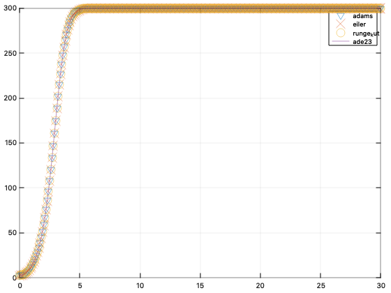

## Эффективность рекламы

---

## Задачи этапа:

- Выделить основные алгоритмы и реализовать их
- Сравнить эффективность работы каждой программы по:
	1. Времени
	2. Точности
	3. Сложность кода
- Выявить наиболее удобную и простую для использования я программу

---

## Используемые алгоритмы

- Алгоритм Эйлера
- Метод Рунге-Кутта 
- Алгоритм Эйлера
- Встроенные функции OCTAVE  для решения дифференциального уравнения методом Рунге-Кутта 2-3 порядка

---

### Метод Эйлера

```python	
	function [x,t]=eiler_m(a,b,n,x0) 
	  tic(); 
	  h=(b-a)/n;
	  x(1)=x0;
	  for i=1:n+1
	    t(i)=a+(i-1)*h;
	  end
	  for i=2:n+1
	    tp=t(i-1)+h/2;
	    xp=x(i-1)+h/2*g(t(i-1),x(i-1));
	    x(i)=x(i-1)+h*g(tp,xp);
	  end
	  established_time = toc()
	end
```

---

### Метод Рунге-Кутта

```python	
	function [x,t]=runge_kut(a,b,n,x0)
	  tic();
	  h=(b-a)/n;
	  x(1)=x0;
	  for i=1:n+1
	    t(i)=a+(i-1)*h;
	  end
	  for i=2:n+1
	    K1=g(t(i-1),x(i-1));
	    K2=g(t(i-1)+h/2,x(i-1)+h/2*K1);
	    K3=g(t(i-1)+h/2,x(i-1)+h/2*K2);
	    K4=g(t(i-1)+h,x(i-1)+h*K3);
	    delt=h/6*(K1+2*K2+2*K3+K4);
	    x(i)=x(i-1)+delt;
	  end
	  established_time = toc()
	end
```

---

### Метод Адамса

```python	
	function [x,t]=adams(a,b,n,x0)
		h=(b-a)/n;
		x(1)=x0;
		for i=1:n+1
			t(i)=a+(i-1)*h;
		end
		for i=2:4
			K1=g(t(i-1),x(i-1));K2=g(t(i-1)+h/2,x(i-1)+h/2*K1);
			K3=g(t(i-1)+h/2,x(i-1)+h/2*K2);K4=g(t(i-1)+h,x(i-1)+h*K3);
			delt=h/6*(K1+2*K2+2*K3+K4);
			x(i)=x(i-1)+delt;
		end
```

---

```python
		for i=4:n
			xp=x(i)+h/24*(-9*g(t(i-3),x(i-3))+37*g(t(i-2),x(i-2))...
			-59*g(t(i-1),x(i-1))+55*g(t(i),x(i)));
			x(i+1)=x(i)+h/24*(g(t(i-2),x(i-2))-5*g(t(i-1),x(i-1))...
			+19*g(t(i),x(i))+9*g(t(i+1),xp));
		end 
	end
```

---

### Использование встроенной функции OCTAVE

```python
	par=odeset ("RelTol", 1e-5, "AbsTol", 1e-5,
		'InitialStep',0.025,'MaxStep',0.1);
	[t, x]=ode23(@g, [0 30], 3, par);
```

---

## Точность



---

## Скорость

```python
	» adams
	established_time = 0.47159
	» euler
	established_time = 0.13775
	» r_k
	established_time = 0.27455
	» ode_mf
	time = 0.93001
```

---

# Оптимальное решение - Алгоритм Эйлера

---

## Исследование зависимости

- Учитывается только показатель сарафанного радио
- Учитывается только показатель рекламной кампании

---

- Сарафанное радио эффективнее рекламаной кампании, но присутствует оба показателя
- Рекламная кампания эффективнее сарафанного радио, но присутствует оба показателя

---

Синий график: $a_1 = 0.055$ ,  $a_2 = 0.0018$

Красный график: $a_1(t) = 0.055t$ , $a_2(t) = 0.0018t$


---
				
Синий график: $a_1 = 0.055$ ,  $a_2 = 0.0018$
				
Красный график: $a_1 = 0.0018$ , $a_2 = 0.055$
					


---

Синий график: $a_1 = 0$ ,  $a_2 = 0.0018$

Красный график: $a_1 = 0.0018$ , $a_2 = 0$


